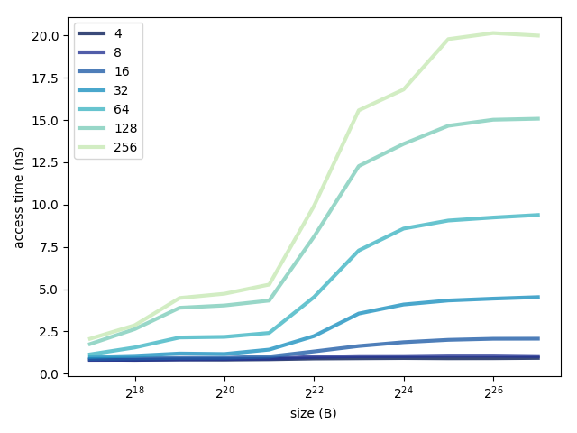

# Report

## 1

This is a graph showing the results of `cache.c`.

|  |
| :---: |
| *Average miss penalty as a function of array size and stride.* |

## 2

Cache performance is good, for all strides, as long as the array is less than 2<sup>21</sup> B. We can infer that the cache size is near 2 MiB.

Cache performance starts to degrade at 32 B stride size, so we can infer that the block size is about 64 B.

It looks like the miss penalty increases when the array size is bigger than 2<sup>16</sup> B and 2<sup>19</sup> B, so it’s possible that this processor also has a 64 KiB cache with an access time near 1 ns and a 512 KiB cache with an access time near 4 ns.

## 3

Now we get actual values and compare them with assumptions.

```console
[ivan@UX310UA ~]$ lscpu
...
L1d cache:                       64 KiB
L1i cache:                       64 KiB
L2 cache:                        512 KiB
L3 cache:                        3 MiB
...
```

```console
[ivan@UX310UA ~]$ cat /proc/cpuinfo
...
cache_alignment : 64
...
```

|| Assumption | Actual
--- | --- | ---
**Cache size** | 2 MiB | 3 MiB
**Block size** | 64 B | 64 B
**Multi-level caches** | <ul><li>L1 = 64 KiB</li><li>L2 = 512 KiB</li></ul> | <ul><li>L1 = 64 KiB</li><li>L2 = 512 KiB</li></ul>